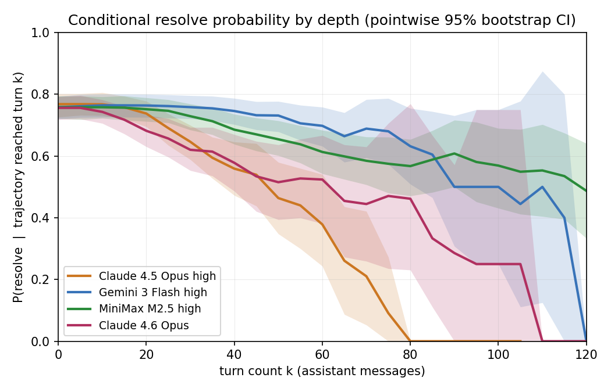

# agent-trajectory-metrics

JetBrains internship submission for *Quality Metrics for Agent Trajectories*. Trajectory analysis on the five top SWE-bench Verified entries on mini-SWE-agent v2: 2,500 trajectories (5 models × 500 tasks).

## Deliverables

The brief asked for three things:

1. **Message-role CLI**: [`traj_metrics.py`](./traj_metrics.py), ~50 LOC. Handles both the `{role, content}` schema and GPT-5-2-Codex's Responses-API messages.
2. **One-page report**: [`report.md`](./report.md) / [`report.pdf`](./report.pdf). Six findings, validation, caveats. Renders to one A4 page.
3. **Paper summary**: [`paper-summary.md`](./paper-summary.md) / [`paper-summary.pdf`](./paper-summary.pdf). Rabanser et al, *Towards a Science of AI Agent Reliability* (arXiv:2602.16666), with two pushbacks and how it lands on this work.

## Headline result

| Model                | pass@1 | $/inst | $/resolved | turns med |
| -------------------- | -----: | -----: | ---------: | --------: |
| Claude 4.5 Opus high |  76.8% |  $0.75 |      $0.98 |        29 |
| Gemini 3 Flash high  |  75.8% |  $0.36 |      $0.47 |        54 |
| MiniMax M2.5 high    |  75.8% |  $0.07 |      $0.10 |        52 |
| Claude 4.6 Opus      |  75.6% |  $0.55 |      $0.73 |        23 |
| GPT-5-2-Codex        |  72.8% |  $0.45 |      $0.62 |        31 |

Top five score within 4.2 points on pass@1; per-instance cost spans 10x; ranked by cost-per-resolved-task the leaderboard inverts. A logistic regression on trajectory shape plus patch-content features predicts the resolved flag at LOMO mean AUC **0.78**, 95% bootstrap CI [0.76, 0.80]. The strongest single patch-content feature is the **Jaccard overlap of changed diff lines**: it ties Mellum-4B-sft-python (0.770) and beats Qwen-Coder-1.5B (0.741). Full writeup in [`report.md`](./report.md).



`S_m(k) = P(resolved | T ≥ k)` collapses very differently across models. Claude 4.5 Opus high goes 77% → 9% over `k = 0, 75`; Gemini 3 Flash holds 76% → 68% across the same range. Validated against the SWE-bench docker harness on a 10-django sample per model: 39/39 matched the leaderboard.

## Run

```bash
python3 traj_metrics.py path/to/trajectory.json
# or pipe stdin
python3 traj_metrics.py < trajectory.json
```

Sample output on `astropy__astropy-12907` from Claude 4.5 Opus high:

```
System messages:     1
User messages:       1
Assistant messages: 32
Tool messages:      32
Exit messages:       1
======================
Total messages:     67
```

The brief's example output stops at `Total: 66`. Real mini-SWE-agent v2 trajectories carry one `exit` message holding the final patch, so the tool surfaces it as its own row to keep the total honest.

## End-to-end pipeline

```bash
python3 download.py              # 5 × 500 trajectories from public S3 (~1.3 GB)
python3 patches.py               # SWE-bench Verified ground-truth patches (HF)
python3 export_patches.py        # extract submitted patches from each trajectory
python3 aggregate.py             # data/features.csv (post-hoc trajectory features)
python3 prefix_features.py       # data/prefix_features.csv (turn-k prefix features)
python3 patch_overlap.py         # adds Jaccard-overlap-of-hunks baseline column

# rsync data/patches/ data/predicted/ to a CUDA box, then on the box:
#   python3 embed_remote.py --data ./data            # Qwen2.5-Coder-1.5B
#   python3 embed_mellum.py --data ./data --batch 1  # JetBrains/Mellum-4b-sft-python
# rsync embeddings*.npy + embeddings*_index.csv back into ./data/

python3 similarity.py            # adds Qwen patch_sim
python3 similarity_mellum.py     # adds Mellum patch_sim_mellum
python3 thrash.py                # adds thrash_depth / window10_max / repeat_rate
python3 classify.py              # post-hoc LOMO classifier (uses final patch)
python3 classify_compare.py      # ablation: shape / +overlap / +qwen / +mellum / +all  (with bootstrap CIs)
python3 classify_prefix.py       # in-flight LOMO + within-model 5-fold CV
python3 plot.py                  # 6 PNGs under plots/
python3 analysis.py              # every number cited in report.md
```

`data/leaderboard.json`, `data/features_with_both_sim.csv`, `data/embeddings.npy`, `data/embeddings_mellum.npy`, and the analysis transcripts are committed so the report numbers can be re-derived without re-downloading 1.3 GB of trajectories or rerunning the GPU jobs. Per-(model, instance) docker-harness reports are under `data/eval_reports/`.

## Files

| Path                                       | Purpose                                                       |
| ------------------------------------------ | ------------------------------------------------------------- |
| `traj_metrics.py`                          | the CLI the brief asks for, ~50 LOC                           |
| `features.py`, `prefix_features.py`        | per-trajectory and per-prefix feature extractors              |
| `download.py`                              | anonymous S3 puller for the 2,500 trajectories                |
| `patches.py`, `export_patches.py`          | ground-truth and submitted patches in flat directories        |
| `embed_remote.py`, `embed_mellum.py`       | GPU-side encoders (Qwen and Mellum)                           |
| `similarity*.py`, `patch_overlap.py`       | three patch-quality features (Qwen, Mellum, Jaccard)          |
| `thrash.py`                                | command-repetition features (depth, window10_max, repeat_rate) |
| `classify.py`, `classify_compare.py`       | post-hoc classifier and feature-subset ablation with CIs      |
| `classify_prefix.py`                       | in-flight LOMO + within-model 5-fold CV                       |
| `plot.py`                                  | six PNGs under `plots/`                                       |
| `analysis.py`, `validate_eval.py`          | reproduces the numbers / cross-checks docker vs leaderboard   |
| `notes/dead-ends.md`                       | things I tried that did not work                              |
| `notes/open-questions.md`                  | what I would chase next                                       |
| `data/features_with_both_sim.csv`          | 2,500 rows × 31 columns (master features table)               |
| `data/embeddings.npy`                      | (3000, 1536) float32, Qwen-Coder-1.5B                         |
| `data/embeddings_mellum.npy`               | (3000, 3072) float32, Mellum-4B-sft-python                    |
| `data/eval_reports/`                       | docker-harness reports for the 10-django validation sample    |
